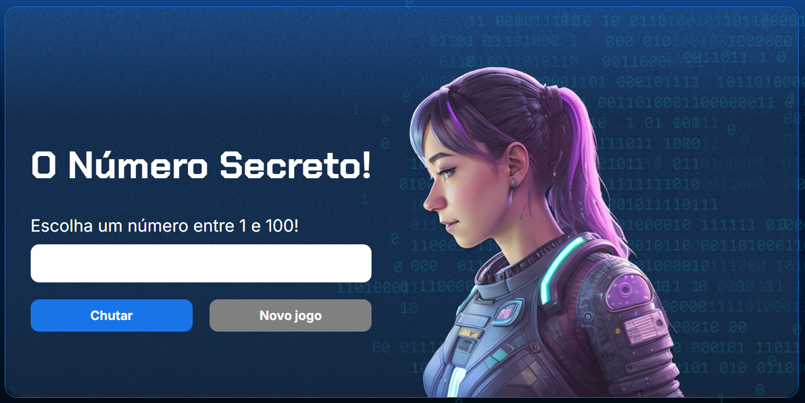

# 🎯 O Número Secreto

Um jogo simples e interativo desenvolvido em **JavaScript**, **HTML** e **CSS**, onde o jogador tenta adivinhar o número secreto gerado aleatoriamente pelo sistema.  
O projeto utiliza síntese de voz para oferecer uma experiência mais envolvente e acessível.

---

## 🚀 Demonstração

🔗 [Acesse o jogo online](https://o-numero-secreto-xi.vercel.app/)

---

## 🧠 Funcionalidades

- Geração aleatória de números entre 1 e 100  
- Feedback por voz com **SpeechSynthesis API**  
- Interface simples e responsiva  
- Opção de reiniciar o jogo após acertar  
- Validação de entrada (impede números fora do intervalo)

---

## 💻 Como executar localmente

1. Clone o repositório:
   ```bash
   git clone https://github.com/WeslleyLafrataSampaio/O_Numero_Secreto
Acesse a pasta do projeto:

bash
Copiar código
cd O_Numero_Secreto
Abra o arquivo index.html no navegador.

📸 Captura de tela


🧑‍💻 Autor
Desenvolvido por Weslley Lafrata Sampaio